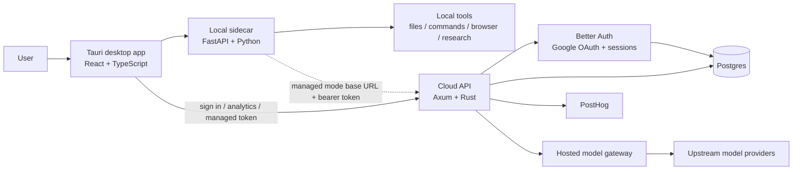

# zWork Architecture

zWork is a desktop-first product with two runtime layers:

- a **local layer** that owns the UI, orchestration loop, and local tool access
- an **optional cloud layer** that owns identity, telemetry, hosted routing, and paid-plan controls

## System diagram

## Runtime split

## Local desktop path

- `app/` renders the product UI.
- `app/src-tauri/` launches the desktop shell and local sidecar process.
- `sidecar/` owns local orchestration, settings, chat streaming, and tool execution.

In local BYOK mode:

- the user signs in for identity and telemetry
- the agent loop still runs locally
- model requests can stay local or use the user’s own configured provider

## Cloud-managed path

The cloud path exists for:

- account-backed sessions
- telemetry aggregation
- managed hosted inference
- plan gating and future billing

In managed mode:

- the desktop app still drives the local loop
- the sidecar points provider traffic at `https://api.tryzwork.app/api/v1`
- the cloud API authenticates the request, tracks usage, and forwards to the configured upstream provider

## Code ownership map

| Area | Path | Responsibility |
|------|------|----------------|
| Desktop UI | `app/src` | screens, settings, analytics, updater UX |
| Tauri shell | `app/src-tauri` | window shell, packaged backend, native auth helpers |
| Local agent backend | `sidecar` | chat execution, settings, skills, local tool access |
| Research pipeline | `sidecar/agent/tools.py` | academic research tools: novelty check, hardware detection, paper drafting |
| Cloud deployment source | `cloud-src` | auth, API, schema, reverse proxy, compose config |
| Tests | `tests` | local backend and security regression coverage |

## High-value flows

## 1. Sign-in flow

1. Desktop app starts unauthenticated and shows the cloud gate.
2. Tauri opens the cloud auth start URL in a browser.
3. Better Auth completes Google OAuth on the server.
4. The server issues a one-time desktop auth code.
5. The desktop app exchanges that code for a bearer token.

## 2. Managed hosted inference

1. Signed-in user activates managed mode in Analytics.
2. Desktop settings are repointed to the hosted gateway base URL.
3. The local sidecar continues orchestrating tool calls.
4. Model requests are forwarded through the cloud API with account-backed usage tracking.

## 3. Updates

1. Desktop app checks the Tauri updater endpoint.
2. Release metadata resolves from GitHub `latest.json`.
3. Native update downloads and installs the signed platform artifact.
4. Manual GitHub fallback is only used when native install is unavailable.

## 4. Academic research pipeline

1. User prompts the agent with a research idea.
2. `detect_hardware` profiles the local environment (GPU/CPU, VRAM, OS).
3. `check_novelty` runs a semantic search over Semantic Scholar and arXiv to validate the idea against existing literature.
4. The agent drafts an outline and iterates through sections using `write_research_paper`.
5. `review_paper` audits the full draft for quality, citation gaps, and structural completeness.
6. The final paper is saved as a local artifact (Markdown or LaTeX).

## Design constraints

- The app must stay useful in local mode.
- Account identity is still required for telemetry, analytics, and plan logic.
- Rate limiting should apply to **user-initiated root requests**, not every internal model/tool continuation.
- Release correctness matters as much as product capability; a broken updater poisons the whole loop.
- Research tools must degrade gracefully when external APIs (Semantic Scholar, arXiv) are unavailable.
