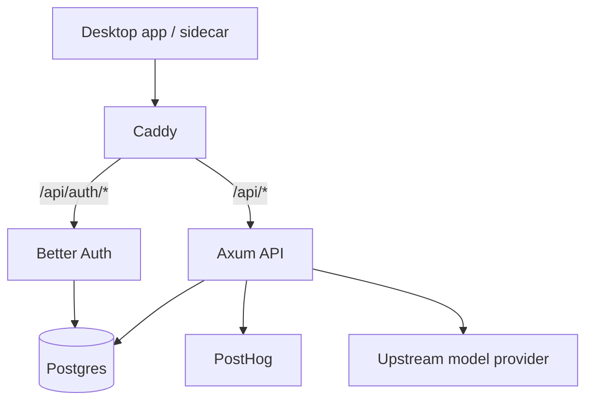

# zWork Cloud Deployment

This document describes the cloud stack that sits behind `api.tryzwork.app`.

## Source of truth

Use `cloud-src/` as the checked-in deployment source.

Relevant files:

- `cloud-src/docker-compose.yml`
- `cloud-src/Caddyfile`
- `cloud-src/api/src/main.rs`
- `cloud-src/auth/index.ts`
- `cloud-src/db/schema.sql`

The older `cloud/` directory is not the deployment source to trust for current behavior.

## Stack

| Service | Path | Responsibility |
|---------|------|----------------|
| Caddy | `cloud-src/Caddyfile` | TLS, host routing, reverse proxy |
| Axum API | `cloud-src/api` | desktop auth exchange, analytics, managed model gateway |
| Better Auth | `cloud-src/auth` | Google OAuth, email/password auth, verification, password reset |
| Postgres | compose service | auth and zWork app state |
| pgAdmin | compose service | admin tooling, intentionally not public |

## Public hosts

| Host | Expected purpose | Current posture |
|------|------------------|-----------------|
| `api.tryzwork.app` | auth + API | public |
| `analytics.tryzwork.app` | shortcut to PostHog | public |
| `db.tryzwork.app` | pgAdmin | blocked with `403` by default |

## Routing model



## Environment variables

Minimum server env:

```bash
DATABASE_URL=postgres://...

GOOGLE_CLIENT_ID=...
GOOGLE_CLIENT_SECRET=...
BETTER_AUTH_SECRET=...
APP_PUBLIC_URL=https://tryzwork.app

SMTP_HOST=...
SMTP_PORT=587
SMTP_SECURE=false
SMTP_USER=...
SMTP_PASS=...
SMTP_FROM="zWork <no-reply@tryzwork.app>"

POSTHOG_API_KEY=...
POSTHOG_HOST=https://us.i.posthog.com

STRIPE_SECRET_KEY=...
STRIPE_WEBHOOK_SECRET=...
STRIPE_PRICE_PRO_MONTHLY=price_...
STRIPE_PRICE_PRO_ANNUAL=price_...

DEEPSEEK_API_KEY=...
DEEPSEEK_BASE_URL=https://api.deepseek.com/anthropic
DEEPSEEK_PROTOCOL=anthropic
DEEPSEEK_MODEL_PRIMARY=deepseek-v4-flash
DEEPSEEK_MODEL_FALLBACK=

AUTH_INTERNAL_BASE=http://better_auth:3000/api/auth
AUTH_SESSION_URL=http://better_auth:3000/api/auth/get-session

ENABLE_HOSTED_GATEWAY=false
ENABLE_BILLING=false
ENABLE_EMAIL_AUTH=false
ENABLE_COUPONS=false

ROOT_REQUESTS_PER_5H=200
WEEKLY_LIMIT_MULTIPLIER=5
MAX_CONCURRENT_ROOT_RUNS=3
DEV_COUPON_CODES=zwork-dev-pro

CORS_ALLOWED_ORIGINS=tauri://localhost,http://tauri.localhost,http://localhost:1420,http://127.0.0.1:1420,https://tryzwork.app,https://www.tryzwork.app,https://api.tryzwork.app
```

Notes:

- for pre-V1 public release on a shared server, leave `ENABLE_HOSTED_GATEWAY`, `ENABLE_BILLING`, `ENABLE_EMAIL_AUTH`, and `ENABLE_COUPONS` set to `false`
- email/password verification requires SMTP env to be valid
- Better Auth sends a verification **link**, not a numeric code
- Stripe billing is only ready when `STRIPE_SECRET_KEY` and at least `STRIPE_PRICE_PRO_MONTHLY` are set
- zWork Router is only ready when at least one provider API key is set

## Deployment

```bash
cd ~/cloud
sudo docker compose up -d --build
```

## Health checks

```bash
curl https://api.tryzwork.app/health
curl -i https://api.tryzwork.app/api/session
curl -i "https://api.tryzwork.app/api/desktop/auth/start?port=43123"
curl -i https://db.tryzwork.app/
```

Expected:

- `/health` returns `OK`
- unauthenticated `/api/session` returns `401`
- `/api/desktop/auth/start` returns `200`
- `db.tryzwork.app` returns `403`

Billing checks:

```bash
curl -i https://api.tryzwork.app/api/analytics/summary
curl -i -X POST https://api.tryzwork.app/api/billing/checkout
```

The checkout route should return `401` signed out, and should return a Stripe checkout URL when called with a valid desktop bearer token on a configured server.

## Security posture

## Already tightened

- desktop auth is server-backed
- public pgAdmin access is disabled at the proxy layer
- cloud API CORS should be restricted to desktop/dev/site origins
- hosted model gateway uses environment configuration rather than source-embedded credentials

## Still worth hardening

- add infra-level secrets management instead of flat `.env`
- reduce auth/API coupling by documenting migration ownership clearly
- add alerting around auth failures and gateway upstream failures
- add server-side metrics for update adoption and auth conversion

## Operational reminders

- coupon unlocks can still exercise the paid path, but Stripe checkout and portal routes now exist and should be treated as the primary paid-plan path
- Rate limits should be enforced on root user requests, not every internal model continuation.
- The updater path is only as trustworthy as the release pipeline; keep the release workflow green and signed.
