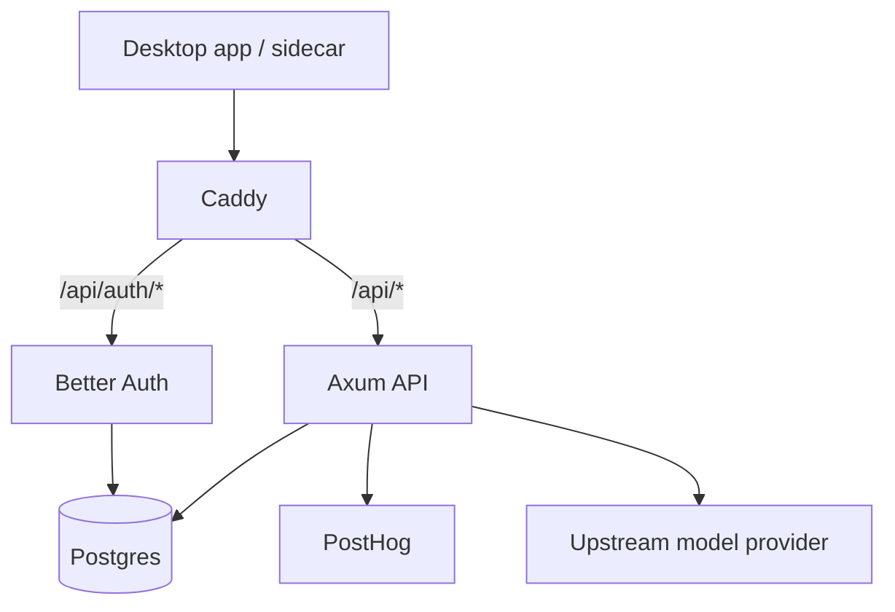

# zWork Cloud Deployment

This document describes the cloud stack that sits behind `api.tryzwork.app`.

## Source of truth

Use `cloud-src/` as the checked-in deployment source.

Relevant files:

- `cloud-src/docker-compose.yml`
- `cloud-src/Caddyfile`
- `cloud-src/api/src/main.rs`
- `cloud-src/auth/index.ts`
- `cloud-src/db/schema.sql`

The older `cloud/` directory is not the deployment source to trust for current behavior.

## Stack

| Service | Path | Responsibility |
|---------|------|----------------|
| Caddy | `cloud-src/Caddyfile` | TLS, host routing, reverse proxy |
| Axum API | `cloud-src/api` | desktop auth exchange, analytics, managed model gateway |
| Better Auth | `cloud-src/auth` | Google OAuth, email/password auth, verification, password reset |
| Postgres | compose service | auth and zWork app state |
| pgAdmin | compose service | admin tooling, intentionally not public |

## Public hosts

| Host | Expected purpose | Current posture |
|------|------------------|-----------------|
| `api.tryzwork.app` | auth + API | public |
| `app.tryzwork.app` | public web chat demo (no login) | public |
| `analytics.tryzwork.app` | shortcut to PostHog | public |
| `db.tryzwork.app` | pgAdmin | blocked with `403` by default |

## Routing model


```mermaid
flowchart TD
    Client[Desktop app / sidecar]
    Caddy[Caddy]
    Axum[Axum API]
    Auth[Better Auth]
    Pg[(Postgres)]
    PostHog[PostHog]
    Upstream[Upstream model provider]

    Client --> Caddy
    Caddy -->|/api/auth/*| Auth
    Caddy -->|/api/*| Axum
    Axum --> Pg
    Auth --> Pg
    Axum --> PostHog
    Axum --> Upstream
```

## Web demo (app.tryzwork.app)

A public, **no-login chat demo** lives at `app.tryzwork.app`. It's the **real
desktop app** (`app/`) running in a "demo mode" with desktop-only features
disabled at runtime — same UI as the desktop app, chat-only, no login. Caddy
serves it from `/var/www/app.tryzwork.app`.

- **Demo mode activation:** `app/src/lib/preview.ts` exports `isDemoMode()`,
  which returns `true` when `window.location.origin` is one of the demo origins
  (`app.tryzwork.app`, `tryzwork.app`, `www.tryzwork.app`, overridable via
  `VITE_ZWORK_DEMO_ORIGIN` at build time). The desktop app (`tauri://localhost`)
  and the vite dev server (`localhost:1420`) never match, so their behavior is
  unchanged — the same source builds both targets.
- **What demo mode disables (all gated on `isDemoMode()`):**
  - **LoginScreen / cloud auth** — a stub user is seeded in `App.tsx`, so the
    auth gate is bypassed. No `fetchCloudSession()`, no BetterAuth.
  - **Chat sends route to `/api/demo/chat`** — `streamChat` in `api.ts` checks
    `isDemoMode()` first and calls `streamChatDemo` (anonymous, no cloud token,
    no `/api/web/chats` persistence) instead of the authenticated gateway.
  - **Desktop-only nav hidden** in `Sidebar.tsx`: Scheduled, Inbox, and the More
    menu (Analytics/Plan/Connectors) are not rendered. New chat, Projects,
    Settings, and chat history remain.
  - **Telemetry / update checker / PostHog** — short-circuited (demo mode is a
    `previewMode` value, and every such effect already early-returns).
  - **Server-side chat refresh** — `refreshChats` no-ops (demo is ephemeral).
- **What stays identical to desktop:** the entire chat UX — Landing greeting,
  composer, message rendering (markdown + KaTeX + syntax highlighting), model
  picker, theme/translucency, keyboard shortcuts, search modal. The UI is the
  same React tree; only the routing + auth + nav are gated.

- **Endpoint:** `POST /api/demo/chat` — `demo_chat` in `cloud-src/api/src/main.rs`.
  It skips `ensure_gateway_access` entirely (no cookie/desktop/service token),
  forwards the conversation to the first Anthropic-protocol provider (DeepSeek),
  and streams the raw Anthropic-shaped SSE response back through
  `sse_stream_with_usage`. The model is the provider's `primary_model`
  (`DEEPSEEK_MODEL_PRIMARY`, default `deepseek-v4-flash`); `max_tokens` is 2 048.
  A locked demo system prompt is injected server-side so the client can't
  override it. The body is `{ messages: [{ role, content }] }` and the assistant
  message is appended live as `content_block_delta` / `message_stop` events.
- **Abuse control (two layers):**
  1. A per-IP `GovernorLayer` (`demo_governor_conf`) — `per_second(1)` +
     `burst_size(3)`, keyed by `SmartIpKeyExtractor` (real client IP from
     `X-Forwarded-For`). Stops a single IP fanning out many concurrent streams.
  2. An in-memory per-IP **daily** cap (`DemoConfig.daily_counts`, default 50/day
     via `DEMO_DAILY_REQUESTS_PER_IP`). IPs are stored SHA-256 hashed + salted,
     never raw. Resets on container restart. The count only increments after the
     upstream accepts the request, so a 5xx from the provider doesn't burn quota.
- **Body caps:** max 20 messages and 32 000 total content chars per request.
- **Env:** `DEMO_ENABLED` (default `true`, kill-switch), `DEMO_DAILY_REQUESTS_PER_IP`
  (default `50`), optional `DEMO_SYSTEM_PROMPT`.
- **Gating:** requires `ENABLE_HOSTED_GATEWAY=true` and a configured Anthropic
  provider; otherwise returns `404 demo_disabled` / `503 demo_backend_not_configured`.

### Deploy the demo

```bash
# Frontend: builds app/ (the real desktop app source) as a web bundle and
# rsyncs dist/ to /var/www/app.tryzwork.app. Demo mode auto-activates on the
# app.tryzwork.app origin. Desktop build (npm run tauri build) is unaffected.
./scripts/deploy-app-demo.sh
```

If the demo *endpoint* code changed, sync the cloud source and rebuild the API
container:

```bash
# Sync updated cloud-src/api → server (skip .env, which holds live secrets), then:
./ssh-connect.sh 'cd ~/cloud && sudo docker compose up -d --build axum_api'
```

> **Note:** `minimal-chat/` is an earlier standalone demo SPA, now superseded.
> `scripts/deploy-web-demo.sh` still deploys it if you ever want it back, but
> the production demo at `app.tryzwork.app` uses `app/` in demo mode.

## Environment variables

Minimum server env:

```bash
DATABASE_URL=postgres://...

GOOGLE_CLIENT_ID=...
GOOGLE_CLIENT_SECRET=...
BETTER_AUTH_SECRET=...
APP_PUBLIC_URL=https://tryzwork.app

SMTP_HOST=...
SMTP_PORT=587
SMTP_SECURE=false
SMTP_USER=...
SMTP_PASS=...
SMTP_FROM="zWork <no-reply@tryzwork.app>"

POSTHOG_API_KEY=...
POSTHOG_HOST=https://us.i.posthog.com

STRIPE_SECRET_KEY=...
STRIPE_WEBHOOK_SECRET=...
STRIPE_PRICE_PRO_MONTHLY=price_...
STRIPE_PRICE_PRO_ANNUAL=price_...

DEEPSEEK_API_KEY=...
DEEPSEEK_BASE_URL=https://api.deepseek.com/anthropic
DEEPSEEK_PROTOCOL=anthropic
DEEPSEEK_MODEL_PRIMARY=deepseek-v4-flash
DEEPSEEK_MODEL_FALLBACK=

AUTH_INTERNAL_BASE=http://better_auth:3000/api/auth
AUTH_SESSION_URL=http://better_auth:3000/api/auth/get-session

ENABLE_HOSTED_GATEWAY=false
ENABLE_BILLING=false
ENABLE_EMAIL_AUTH=false
ENABLE_COUPONS=false

ROOT_REQUESTS_PER_5H=200
WEEKLY_LIMIT_MULTIPLIER=5
MAX_CONCURRENT_ROOT_RUNS=3
DEV_COUPON_CODES=zwork-dev-pro

CORS_ALLOWED_ORIGINS=tauri://localhost,http://tauri.localhost,http://localhost:1420,http://127.0.0.1:1420,https://tryzwork.app,https://www.tryzwork.app,https://api.tryzwork.app
```

Notes:

- for pre-V1 public release on a shared server, leave `ENABLE_HOSTED_GATEWAY`, `ENABLE_BILLING`, `ENABLE_EMAIL_AUTH`, and `ENABLE_COUPONS` set to `false`
- email/password verification requires SMTP env to be valid
- Better Auth sends a verification **link**, not a numeric code
- Stripe billing is only ready when `STRIPE_SECRET_KEY` and at least `STRIPE_PRICE_PRO_MONTHLY` are set
- zWork Router is only ready when at least one provider API key is set

## Deployment

```bash
cd ~/cloud
sudo docker compose up -d --build
```

## Health checks

```bash
curl https://api.tryzwork.app/health
curl -i https://api.tryzwork.app/api/session
curl -i "https://api.tryzwork.app/api/desktop/auth/start?port=43123"
curl -i https://db.tryzwork.app/
```

Expected:

- `/health` returns `OK`
- unauthenticated `/api/session` returns `401`
- `/api/desktop/auth/start` returns `200`
- `db.tryzwork.app` returns `403`

Billing checks:

```bash
curl -i https://api.tryzwork.app/api/analytics/summary
curl -i -X POST https://api.tryzwork.app/api/billing/checkout
```

The checkout route should return `401` signed out, and should return a Stripe checkout URL when called with a valid desktop bearer token on a configured server.

## Security posture

## Already tightened

- desktop auth is server-backed
- public pgAdmin access is disabled at the proxy layer
- cloud API CORS should be restricted to desktop/dev/site origins
- hosted model gateway uses environment configuration rather than source-embedded credentials
- admin dashboard tokens are HMAC-signed and session-backed (see "Admin dashboard" below)

## Still worth hardening

- add infra-level secrets management instead of flat `.env`
- reduce auth/API coupling by documenting migration ownership clearly
- add alerting around auth failures and gateway upstream failures
- add server-side metrics for update adoption and auth conversion

## Operational reminders

- coupon unlocks can still exercise the paid path, but Stripe checkout and portal routes now exist and should be treated as the primary paid-plan path
- Rate limits should be enforced on root user requests, not every internal model continuation.
- The updater path is only as trustworthy as the release pipeline; keep the release workflow green and signed.

## Admin dashboard

The admin dashboard is a standalone Vite SPA in `admin-web/`, deployed to **`admin.tryzwork.app`**. It imports its dashboard components directly from `../app/src/components/admin/` (single source of truth — the same code renders in the desktop app's `/admin` view too). It is password-gated and backed by `/api/admin/*` endpoints in `cloud-src/api/src/main.rs`.

**Access:** open `https://admin.tryzwork.app` in a browser and enter the admin password (`ADMIN_PASSWORD` env). Not listed in the desktop app sidebar.

**Deploy:** `./scripts/deploy-admin-web.sh` (mirrors `deploy-web-demo.sh` — builds `admin-web/`, rsyncs `dist/` to `/var/www/admin.tryzwork.app` on the VM). On first deploy you also need a DNS A record for `admin.tryzwork.app` pointing at the VM, and a Caddy reload so it picks up the new host block (the script prints both reminders).

### Auth

- `POST /api/admin/verify-password` checks the password against `ADMIN_PASSWORD` (constant-time compare), then mints an HMAC-SHA256-signed token signed with `ADMIN_TOKEN_SECRET`.
- The token format is `admin_<base64url(json payload)>.<base64url(hmac sig)>` where the payload carries `{email, iat, exp, sid}`.
- Only the SHA-256 hash of each token is persisted in `admin_sessions` (so tokens can be revoked individually and `last_used_at` can be tracked without storing the raw bearer).
- Every admin request goes through `ensure_owner_or_service`, which verifies the signature, checks `exp`, confirms the session exists and isn't revoked, then bumps `last_used_at`.
- `POST /api/admin/logout` marks the current session `revoked_at = NOW()`.
- Owner-email membership (`OWNER_EMAILS` env) is an alternative path into the same admin endpoints.

**Required env for production:** `ADMIN_TOKEN_SECRET` (generate with `openssl rand -hex 32`). If unset, the API derives a key from `ADMIN_PASSWORD` and logs a warning — acceptable for local dev only. `ADMIN_TOKEN_TTL_HOURS` defaults to `12`.

### Audit log

Tier changes, logins, and logouts are written to `admin_audit_log` via the `audit_admin_action` helper. Surfaced at `GET /api/admin/audit?limit=200` and in the dashboard's **Audit** tab.

### Metrics endpoints

All gated by `ensure_owner_or_service`. Query param `days` (default varies) controls the lookback window.

| Endpoint | Purpose |
|---|---|
| `GET /api/admin/metrics/overview` | Aggregate business KPIs (users, MRR, ARPU, conversion, cost) |
| `GET /api/admin/metrics/health?days=7` | Error rate, status-code breakdown, latency p50/p95/p99, TTFT, retries, top failing models, daily series |
| `GET /api/admin/metrics/providers?days=7` | Per-provider request/error/latency aggregates joined with latest rate-limit snapshot |
| `GET /api/admin/metrics/revenue?days=90` | Current MRR, ARPU, paid users, new-subs/churn counts in window, gross margin, daily + tier-split series |
| `GET /api/admin/metrics/engagement?days=30` | DAU/WAU/MAU, stickiness, new-vs-returning daily, top active users |
| `GET /api/admin/metrics/live` | Active users / requests / tokens in last 5m, recent-requests feed (polled every 10s by the Live tab) |
| `GET /api/admin/users` | Full user table with usage + subscription summary |
| `GET /api/admin/usage/by-time?days=30` | Daily request/token rollup |
| `GET /api/admin/usage/by-model?days=30` | Per-model request/token rollup |
| `PUT /api/admin/users/:user_id/tier` | Change a user's tier (audited) |
| `GET /api/admin/audit?limit=200` | Recent admin actions |

### Dashboard tabs

The frontend (`app/src/components/AdminPage.tsx` + `app/src/components/admin/`) renders nine tabs: **Overview, Health, Revenue, Engagement, Users, Usage, Models, Live, Audit**. Charts use `recharts` and the app's existing design tokens (CSS-variable RGB triplets) so they adapt to light/dark themes.
