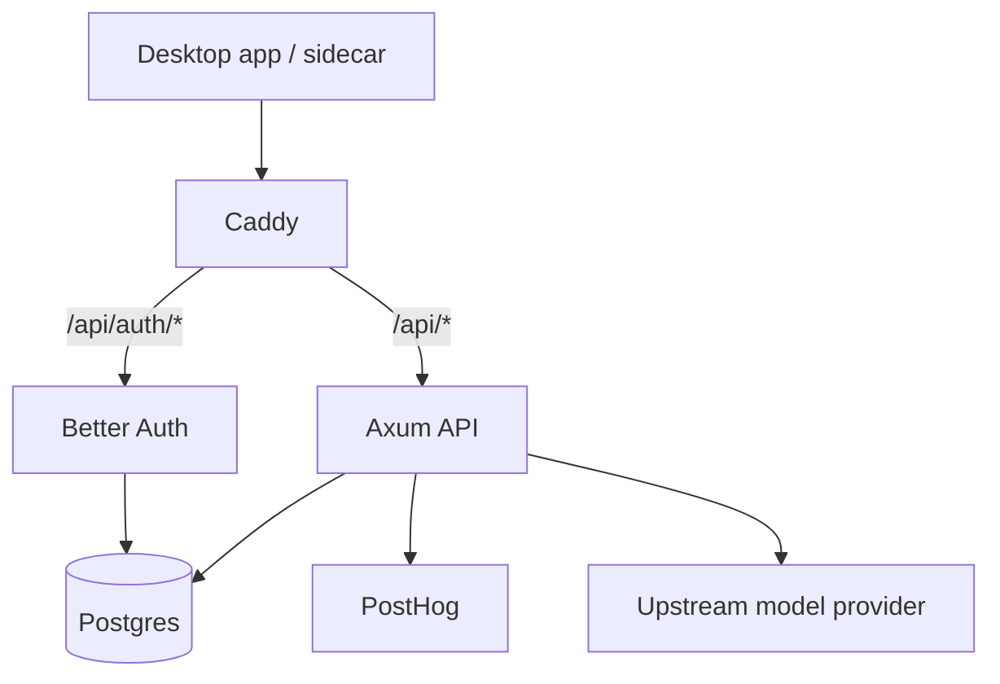

# zWork Cloud Deployment

This document describes the cloud stack that sits behind `api.tryzwork.app`.

## Source of truth

Use `cloud-src/` as the checked-in deployment source.

Relevant files:

- `cloud-src/docker-compose.yml`
- `cloud-src/Caddyfile`
- `cloud-src/api/src/main.rs`
- `cloud-src/auth/index.ts`
- `cloud-src/db/schema.sql`

The older `cloud/` directory is not the deployment source to trust for current behavior.

## Stack

| Service | Path | Responsibility |
|---------|------|----------------|
| Caddy | `cloud-src/Caddyfile` | TLS, host routing, reverse proxy |
| Axum API | `cloud-src/api` | desktop auth exchange, analytics, managed model gateway |
| Better Auth | `cloud-src/auth` | Google OAuth, email/password auth, verification, password reset |
| Postgres | compose service | auth and zWork app state |
| pgAdmin | compose service | admin tooling, intentionally not public |

## Public hosts

| Host | Expected purpose | Current posture |
|------|------------------|-----------------|
| `api.tryzwork.app` | auth + API | public |
| `app.tryzwork.app` | public web chat demo (no login) | public |
| `analytics.tryzwork.app` | shortcut to PostHog | public |
| `db.tryzwork.app` | pgAdmin | blocked with `403` by default |

## Routing model


```mermaid
flowchart TD
    Client[Desktop app / sidecar]
    Caddy[Caddy]
    Axum[Axum API]
    Auth[Better Auth]
    Pg[(Postgres)]
    PostHog[PostHog]
    Upstream[Upstream model provider]

    Client --> Caddy
    Caddy -->|/api/auth/*| Auth
    Caddy -->|/api/*| Axum
    Axum --> Pg
    Auth --> Pg
    Axum --> PostHog
    Axum --> Upstream
```

## Web demo (app.tryzwork.app)

A public, **no-login chat demo** lives at `app.tryzwork.app`. It's the **real
desktop app** (`app/`) running in a "demo mode" with desktop-only features
disabled at runtime — same UI as the desktop app, chat-only, no login. Caddy
serves it from `/var/www/app.tryzwork.app`.

- **Demo mode activation:** `app/src/lib/preview.ts` exports `isDemoMode()`,
  which returns `true` when `window.location.origin` is one of the demo origins
  (`app.tryzwork.app`, `tryzwork.app`, `www.tryzwork.app`, overridable via
  `VITE_ZWORK_DEMO_ORIGIN` at build time). The desktop app (`tauri://localhost`)
  and the vite dev server (`localhost:1420`) never match, so their behavior is
  unchanged — the same source builds both targets.
- **What demo mode disables (all gated on `isDemoMode()`):**
  - **LoginScreen / cloud auth** — a stub user is seeded in `App.tsx`, so the
    auth gate is bypassed. No `fetchCloudSession()`, no BetterAuth.
  - **Chat sends route to `/api/demo/chat`** — `streamChat` in `api.ts` checks
    `isDemoMode()` first and calls `streamChatDemo` (anonymous, no cloud token,
    no `/api/web/chats` persistence) instead of the authenticated gateway.
  - **Desktop-only nav hidden** in `Sidebar.tsx`: Scheduled, Inbox, and the More
    menu (Analytics/Plan/Connectors) are not rendered. New chat, Projects,
    Settings, and chat history remain.
  - **Telemetry / update checker / PostHog** — short-circuited (demo mode is a
    `previewMode` value, and every such effect already early-returns).
  - **Server-side chat refresh** — `refreshChats` no-ops (demo is ephemeral).
- **What stays identical to desktop:** the entire chat UX — Landing greeting,
  composer, message rendering (markdown + KaTeX + syntax highlighting), model
  picker, theme/translucency, keyboard shortcuts, search modal. The UI is the
  same React tree; only the routing + auth + nav are gated.

- **Endpoint:** `POST /api/demo/chat` — `demo_chat` in `cloud-src/api/src/main.rs`.
  It skips `ensure_gateway_access` entirely (no cookie/desktop/service token),
  forwards the conversation to the first Anthropic-protocol provider (DeepSeek),
  and streams the raw Anthropic-shaped SSE response back through
  `sse_stream_with_usage`. The model is the provider's `primary_model`
  (`DEEPSEEK_MODEL_PRIMARY`, default `deepseek-flash`); `max_tokens` is 2 048.
  A locked demo system prompt is injected server-side so the client can't
  override it. The body is `{ messages: [{ role, content }] }` and the assistant
  message is appended live as `content_block_delta` / `message_stop` events.
- **Abuse control (two layers):**
  1. A per-IP `GovernorLayer` (`demo_governor_conf`) — `per_second(1)` +
     `burst_size(3)`, keyed by `SmartIpKeyExtractor` (real client IP from
     `X-Forwarded-For`). Stops a single IP fanning out many concurrent streams.
  2. An in-memory per-IP **daily** cap (`DemoConfig.daily_counts`, default 50/day
     via `DEMO_DAILY_REQUESTS_PER_IP`). IPs are stored SHA-256 hashed + salted,
     never raw. Resets on container restart. The count only increments after the
     upstream accepts the request, so a 5xx from the provider doesn't burn quota.
- **Body caps:** max 20 messages and 32 000 total content chars per request.
- **Env:** `DEMO_ENABLED` (default `true`, kill-switch), `DEMO_DAILY_REQUESTS_PER_IP`
  (default `50`), optional `DEMO_SYSTEM_PROMPT`.
- **Gating:** requires `ENABLE_HOSTED_GATEWAY=true` and a configured Anthropic
  provider; otherwise returns `404 demo_disabled` / `503 demo_backend_not_configured`.

### Deploy the demo

```bash
# Frontend: builds app/ (the real desktop app source) as a web bundle and
# rsyncs dist/ to /var/www/app.tryzwork.app. Demo mode auto-activates on the
# app.tryzwork.app origin. Desktop build (npm run tauri build) is unaffected.
./scripts/deploy-app-demo.sh
```

If the demo *endpoint* code changed, sync the cloud source and rebuild the API
container:

```bash
# Sync updated cloud-src/api → server (skip .env, which holds live secrets), then:
./ssh-connect.sh 'cd ~/cloud && sudo docker compose up -d --build axum_api'
```

> Every public host, what serves it and how it is deployed is listed in
> [INVENTORY.md](INVENTORY.md).

## Environment variables

Minimum server env:

```bash
DATABASE_URL=postgres://...

GOOGLE_CLIENT_ID=...
GOOGLE_CLIENT_SECRET=...
BETTER_AUTH_SECRET=...
APP_PUBLIC_URL=https://tryzwork.app

SMTP_HOST=...
SMTP_PORT=587
SMTP_SECURE=false
SMTP_USER=...
SMTP_PASS=...
SMTP_FROM="zWork <no-reply@tryzwork.app>"

POSTHOG_API_KEY=...
POSTHOG_HOST=https://us.i.posthog.com

STRIPE_SECRET_KEY=...
STRIPE_WEBHOOK_SECRET=...
STRIPE_PRICE_PRO_MONTHLY=price_...
STRIPE_PRICE_PRO_ANNUAL=price_...

DEEPSEEK_API_KEY=...
DEEPSEEK_BASE_URL=https://api.deepseek.com/anthropic
DEEPSEEK_PROTOCOL=anthropic
DEEPSEEK_MODEL_PRIMARY=deepseek-flash
DEEPSEEK_MODEL_FALLBACK=

AUTH_INTERNAL_BASE=http://better_auth:3000/api/auth
AUTH_SESSION_URL=http://better_auth:3000/api/auth/get-session

ENABLE_HOSTED_GATEWAY=false
ENABLE_BILLING=false
ENABLE_EMAIL_AUTH=false
ENABLE_COUPONS=false

ROOT_REQUESTS_PER_5H=200
WEEKLY_LIMIT_MULTIPLIER=5
MAX_CONCURRENT_ROOT_RUNS=3
DEV_COUPON_CODES=zwork-dev-pro

CORS_ALLOWED_ORIGINS=tauri://localhost,http://tauri.localhost,http://localhost:1420,http://127.0.0.1:1420,https://tryzwork.app,https://www.tryzwork.app,https://api.tryzwork.app
```

Notes:

- for pre-V1 public release on a shared server, leave `ENABLE_HOSTED_GATEWAY`, `ENABLE_BILLING`, `ENABLE_EMAIL_AUTH`, and `ENABLE_COUPONS` set to `false`
- email/password verification requires SMTP env to be valid
- Better Auth sends a verification **link**, not a numeric code
- Stripe billing is only ready when `STRIPE_SECRET_KEY` and at least `STRIPE_PRICE_PRO_MONTHLY` are set
- zWork Router is only ready when at least one provider API key is set

## Deployment

```bash
cd ~/cloud
sudo docker compose up -d --build
```

## Health checks

```bash
curl https://api.tryzwork.app/health
curl -i https://api.tryzwork.app/api/session
curl -i "https://api.tryzwork.app/api/desktop/auth/start?port=43123"
curl -i https://db.tryzwork.app/
```

Expected:

- `/health` returns `OK`
- unauthenticated `/api/session` returns `401`
- `/api/desktop/auth/start` returns `200`
- `db.tryzwork.app` returns `403`

Billing checks:

```bash
curl -i https://api.tryzwork.app/api/analytics/summary
curl -i -X POST https://api.tryzwork.app/api/billing/checkout
```

The checkout route should return `401` signed out, and should return a Stripe checkout URL when called with a valid desktop bearer token on a configured server.

## Security posture

## Already tightened

- desktop auth is server-backed
- public pgAdmin access is disabled at the proxy layer
- cloud API CORS should be restricted to desktop/dev/site origins
- hosted model gateway uses environment configuration rather than source-embedded credentials
- admin dashboard tokens are HMAC-signed and session-backed (see "Admin dashboard" below)

## Still worth hardening

- add infra-level secrets management instead of flat `.env`
- reduce auth/API coupling by documenting migration ownership clearly
- add alerting around auth failures and gateway upstream failures
- add server-side metrics for update adoption and auth conversion

## Operational reminders

- coupon unlocks can still exercise the paid path, but Stripe checkout and portal routes now exist and should be treated as the primary paid-plan path
- Rate limits should be enforced on root user requests, not every internal model continuation.
  The desktop sidecar tags every hosted-router call with `x-zwork-run-id`,
  `x-zwork-trigger` (`schedule`, `chat` or `background`), `x-zwork-app-version`
  and `x-zwork-os`. When a call has a run id but no `x-zwork-request-kind`, the
  API stores it as a continuation if that user already has a request under the
  same run, so a multi-step task uses one message of the quota. Builds from
  before run tagging (and background helper calls such as chat titles, which get
  their own run id) still count each call as a message.
- The updater path is only as trustworthy as the release pipeline; keep the release workflow green and signed.

## Admin dashboard

The admin dashboard is a standalone Vite SPA in `admin-web/`, deployed to **`admin.tryzwork.app`**. It imports its dashboard components directly from `../app/src/components/admin/` (single source of truth — the same code renders in the desktop app's `/admin` view too). It is password-gated and backed by `/api/admin/*` endpoints in `cloud-src/api/src/main.rs`.

**Access:** open `https://admin.tryzwork.app` in a browser and enter the admin password (`ADMIN_PASSWORD` env). Not listed in the desktop app sidebar.

**Deploy:** `./scripts/deploy-admin-web.sh` (builds `admin-web/`, rsyncs `dist/` to `/var/www/admin.tryzwork.app` on the VM). On first deploy you also need a DNS A record for `admin.tryzwork.app` pointing at the VM, and a Caddy reload so it picks up the new host block (the script prints both reminders).

### Auth

- `POST /api/admin/verify-password` checks the password against `ADMIN_PASSWORD` (constant-time compare), then mints an HMAC-SHA256-signed token signed with `ADMIN_TOKEN_SECRET`.
- The token format is `admin_<base64url(json payload)>.<base64url(hmac sig)>` where the payload carries `{email, iat, exp, sid}`.
- Only the SHA-256 hash of each token is persisted in `admin_sessions` (so tokens can be revoked individually and `last_used_at` can be tracked without storing the raw bearer).
- Every admin request goes through `ensure_owner_or_service`, which verifies the signature, checks `exp`, confirms the session exists and isn't revoked, then bumps `last_used_at`.
- `POST /api/admin/logout` marks the current session `revoked_at = NOW()`.
- Owner-email membership (`OWNER_EMAILS` env) is an alternative path into the same admin endpoints.

**Required env for production:** `ADMIN_TOKEN_SECRET` (generate with `openssl rand -hex 32`). If unset, the API derives a key from `ADMIN_PASSWORD` and logs a warning — acceptable for local dev only. `ADMIN_TOKEN_TTL_HOURS` defaults to `12`.

### Audit log

Tier changes, logins, and logouts are written to `admin_audit_log` via the `audit_admin_action` helper. Surfaced at `GET /api/admin/audit?limit=200` and in the dashboard's **Audit** tab.

### Metrics endpoints

All gated by `ensure_owner_or_service`. Endpoints with a window take `?days=N`
(default **7**, clamped to the max below). Days are UTC.

| Endpoint | Max days | Purpose |
|---|---|---|
| `GET /api/admin/metrics/overview` | | All-time business KPIs (users, active 7d/30d, MRR, ARPU, conversion, tokens, est. cost) |
| `GET /api/admin/metrics/health` | 90 | Error rate, status-code breakdown, latency p50/p95/p99, TTFT, retries, top failing models, daily series |
| `GET /api/admin/metrics/providers` | 90 | Per-provider request/error/latency aggregates joined with latest rate-limit snapshot |
| `GET /api/admin/metrics/revenue` | 365 | Current MRR, ARPU, paid users, new subs / cancellations in window, gross margin, daily + tier-split series |
| `GET /api/admin/metrics/engagement` | 90 | DAU/WAU/MAU, stickiness, new-vs-returning daily, top active users |
| `GET /api/admin/metrics/live` | | Active users / requests / tokens in the last 5 min and the recent-requests feed (the Live tab polls it every 10 s) |
| `GET /api/admin/metrics/finance` | 365 | Upstream spend vs revenue: window and previous window, month-to-date with projection, last month, spend by tier (free/pro/max) and paying vs not, daily spend by tier, spend by model, top spenders, paying users who cost more than they pay, and how much traffic is unpriced |
| `GET /api/admin/metrics/downloads` | | GitHub release downloads (installers by platform and release, update bundles, update checks), stars/forks/issues, daily deltas from `release_download_snapshots`, app versions and OSes seen by the gateway in the last 7 days |
| `GET /api/admin/metrics/funnel` | 365 | Signup → first request → active on 3+ days → subscribed for users who signed up in the window, median hours to first request, and weekly retention for the last 8 signup cohorts |
| `GET /api/admin/metrics/status` | | Every public host probed from the server (expected status per host), database size and largest tables, and which integrations and providers are configured |
| `GET /api/admin/metrics/jobs` | 365 | Runs, requests, users and spend by trigger (`schedule`, `chat`, `background`, `untagged`), runs per day by trigger, users with a scheduled run per week, top schedulers, and the last 24 hours' telemetry gaps (no version, no OS, no trigger, share stored as continuations) |
| `GET /api/admin/users` | | Full user table with usage + subscription summary, 30-day runs and scheduled runs, and the latest app version seen |
| `GET /api/admin/users/:user_id/activity` | 365 | One user's requests, runs and spend per day, models, triggers, builds (version × OS) and the 15 most recent runs |
| `GET /api/admin/usage/by-time` | 365 | Daily request/token rollup, newest first |
| `GET /api/admin/usage/by-model` | 365 | Per-model request/token rollup for the window |
| `PUT /api/admin/users/:user_id/tier` | | Change a user's tier (`free`, `pro`, `max`; audited). zWork only: it does not touch Stripe |
| `GET /api/admin/audit?limit=200` | | Recent admin actions (limit 1–1000) |

When you add or change an endpoint, update the matching handler in
`admin-web/mock/mockApi.ts` so `npm run dev:mock` keeps working.

### How the numbers are defined

- **Active** means at least one gateway request in the window. Rows come from
  the gateway request log, so desktop usage on a user's own API key isn't counted.
- **MRR** comes live from Stripe on each request (`compute_current_mrr`): active
  subscriptions, with discounts applied and annual prices divided by 12. It is 0
  when `STRIPE_SECRET_KEY` is unset. **ARPU** is MRR ÷ *all* users, not paying users.
- **`churn_rate`** in the overview is (active 30d − active 7d) ÷ active 30d:
  users who were active this month but not this week. The dashboard labels it
  **Lapsed**, because it isn't subscription churn. Subscription churn is
  `churned_in_window` / `cancellations` on the revenue endpoint.
- **Provider cost** is estimated from token counts × list prices per model. It
  is not an invoice.
- **Spend by tier** uses each user's *current* tier, because requests don't
  record the tier they were made on. **Paying** means a live Stripe
  subscription (`active`, `trialing` or `past_due`); coupon and dev users on a
  paid tier count as non-paying. Per-tier revenue uses list prices
  (`tier_monthly_price`), so it ignores Stripe discounts; the total uses MRR.
- **Unpriced** requests returned tokens for a provider/model missing from
  `estimate_cost`, so they stored no cost. Add the model there when the
  finance tab shows unpriced traffic.
- **Downloads**: GitHub only keeps lifetime counts. The API snapshots them
  hourly into `release_download_snapshots` (one row per day) and the daily
  series is the difference between days, so it starts the day after deploy.
  `latest.json` is fetched on every update check, so it's reported separately
  from installer and update-bundle downloads. Set `GITHUB_TOKEN` (no scopes
  needed) to raise GitHub's 60 requests/hour anonymous limit; `GITHUB_REPO`
  overrides `Ryz3nPlayZ/zWork`.
- **Runs and triggers.** A run is one task: all model calls that share a
  `run_id`. `gateway_requests.run_trigger` stores the `x-zwork-trigger` header;
  rows without it are **untagged** (builds from before run tagging, which also
  gave every call its own run id). Scheduler run ids start with `sched_`.
- **Gross margin** compares like with like. Daily margin is MRR ÷ 30 minus that
  day's cost. The window margin is MRR × days ÷ 30 minus the window's cost, as a
  share of that revenue (floored at −100%).

### Dashboard tabs

The frontend (`app/src/components/AdminPage.tsx` + `app/src/components/admin/`) has a grouped sidebar (a scrolling tab row on narrow windows):

| Group | Tab | What it answers | Endpoint |
|-------|-----|-----------------|----------|
| | **Overview** | Headline numbers, scheduled work, plus a "Needs attention" list built from the other endpoints (a surface down, error rate ≥ 2%, unprofitable paying users, margin under 30%, free users over half of spend, unpriced models, spend on track for 1.5× last month, under half of active users on a week-old release, stale GitHub stats, over 5% of traffic from builds without run tags) | overview, finance, health, status, downloads, jobs |
| Business | **Finance** | Upstream spend vs revenue and margin, month projection, free vs paying spend, spend per tier, unprofitable paying users, top spenders, spend by model, unpriced traffic | `finance` |
| | **Revenue** | MRR, subscriptions and churn | `revenue` |
| | **Growth** | Installer and update downloads, versions in use, the sign-up → request → 3 active days → subscribed funnel, weekly retention cohorts | `downloads`, `funnel` |
| Product | **Jobs** | Scheduled vs chat runs, users with schedules per week, calls and spend per run, who runs work on a schedule, how much traffic is still untagged | `jobs` |
| | **Users** | Accounts, tiers, runs and versions; click a row for that user's activity | `users`, `users/:id/activity` |
| | **Usage**, **Models**, **Engagement** | Request volume, per-model traffic and failures, retention and feature use | `usage/*`, `engagement` |
| Ops | **Health**, **Live** | Gateway errors, latency, provider saturation; the last few minutes | `health`, `live` |
| | **Status** | Every public host with its expected status code, database latency and largest tables, which integrations have keys | `status` |
| | **Audit** | Admin sign-ins and changes | `audit` |

Charts use `recharts` and the app's design tokens (CSS-variable RGB triplets), so they adapt to light/dark themes. Tables sort by any column and export the current view as CSV.

The active tab lives in the URL hash (`#finance`), so links and reloads keep it. Keys: `1`–`9` jump to the first nine tabs in sidebar order, `j`/`k` step to the next/previous tab, `r` refreshes.

### Local development

```bash
cd admin-web
npm run dev:mock    # seeded fake API, any password works, tier changes stay in memory
npm run dev         # proxies /api to production: real password, real data, real writes
```

Both serve on http://localhost:4311. See `admin-web/README.md`.
